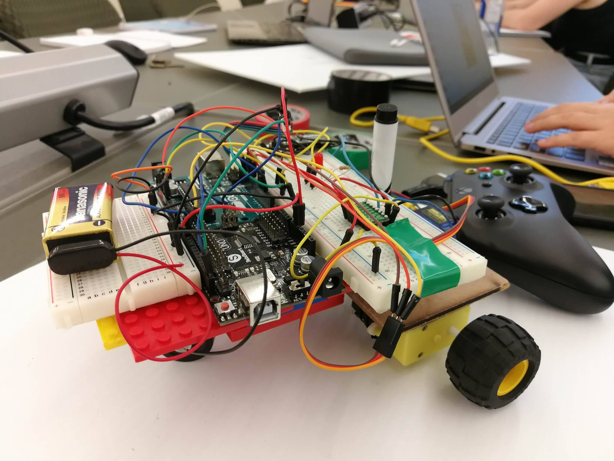
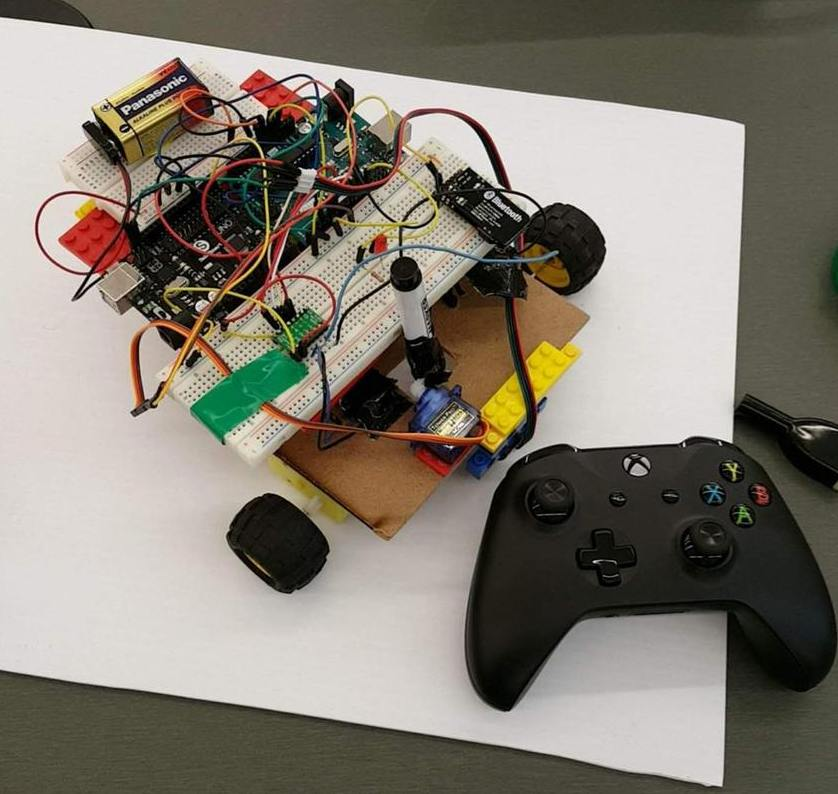
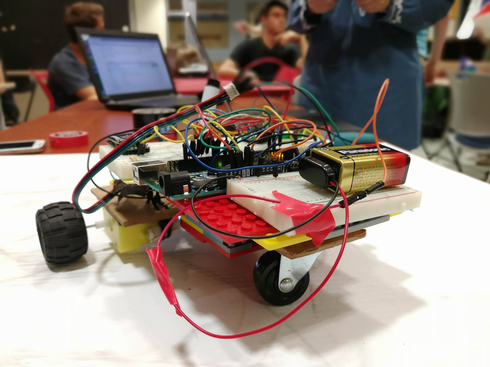
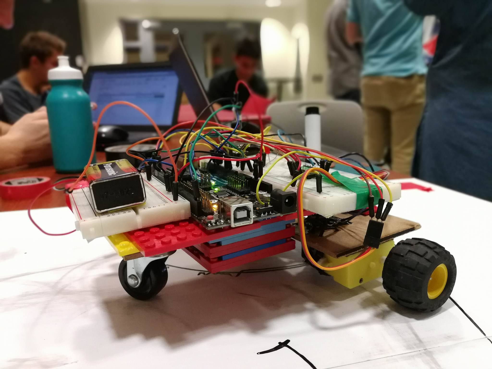

# MiniProjects 2017
*See src/ for all final source code*

Meet CHAD

A differential drive drawing robot fully maneuverable with an Xbox Controller, built in a week!

#

#

#

# The Code
CHAD is controlled by two arduinos, the code for which can be found in src/Chad_1 and src/Chad_2 respectively.

Chad_1 receives the inputs from the xbox controller joysticks and moves the wheels accordingly, while Chad_2 controls the servo motor which can raise and lower the marker CHAD uses to draw.

# Usage
Connect a USB Game Controller to your computer and run `./src/controller.py` to connect to CHAD over bluetooth and begin sending commands.
#
\
Copyright 2017 Daniel Besson, Gabriel Downs, Julien Schmidt, Sara Tawil, Tim Wang

This project is free software, licensed under the GNU GPL.\
See included `LICENSE` file, or <http://www.gnu.org/licenses/> for more details
