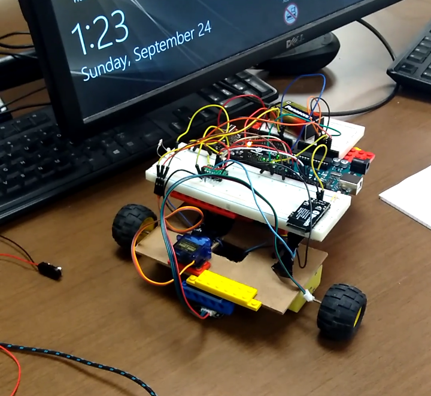

# MiniProjects 2017

Meet CHAD

A drawing robot fully maneuverable with an Xbox Controller

CHAD is controlled by two arduinos, the code for which can be found in src/Chad_1 and src/Chad_2 respectively.

Chad_1 receives the inputs from the xbox controller joysticks and moves the wheels accordingly, while Chad_2 controls the servo motor which can raise and lower the marker CHAD uses to draw.
